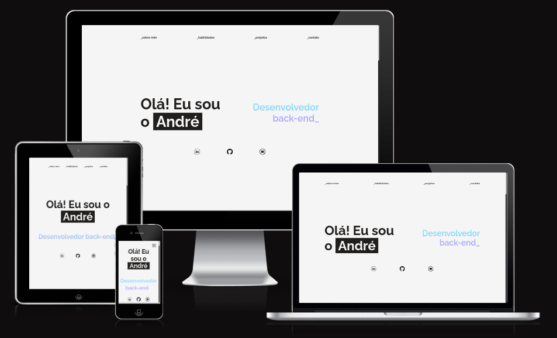

<h1 align="center">
    André Sousa - Portfolio
</h1>

    

    This is the web version of my portfolio, feel free to visit it! It was a great opportunity to acquire experience on front-end development with pure HTML, CSS and Javascript.

## Preview

    

## Technologies Used
- HTML
- CSS
- Javascript

## Libraries Used
- [Swiper.js](https://swiperjs.com/)